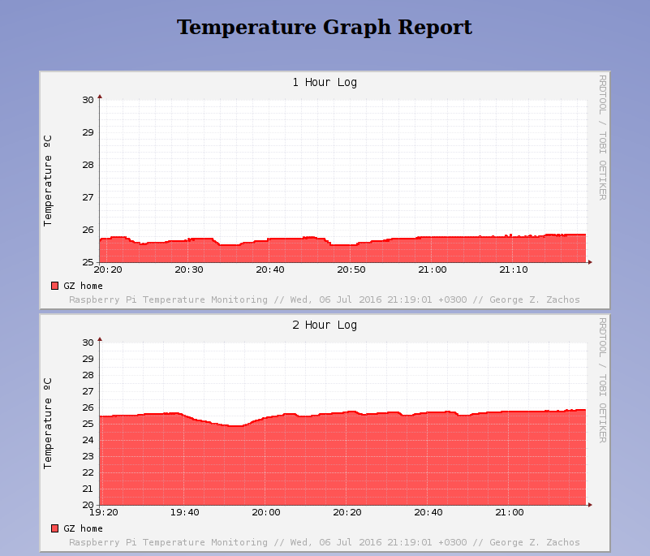
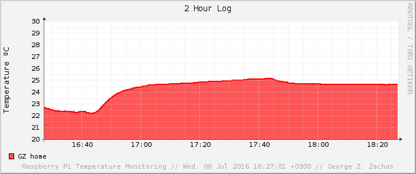
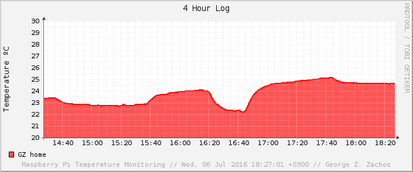
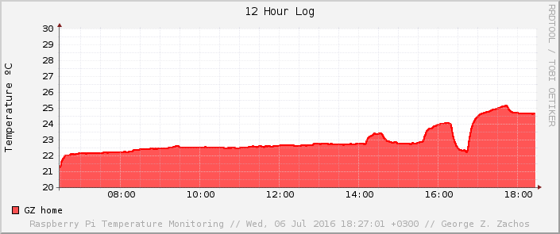

# rpi-temperature

## About
This repository contains the scripts required to:
  * Measure air temperature using a Raspberry Pi
  * Store the measurements taken in a Round-Robin Database
  * Create a graphical representation of the data stored
  * Create an ultra simple webpage to display the graphs

## Specifications
Raspberry Pi model: B+ <br>
Sensor model: DS18B20 (waterproof) <br>
Kernel release: 4.1.19+ (Raspbian) <br>
RRDtool version: 1.4.7 <br>
The graphs will be of PNG file format <br>

## Installation
Install RRDtool and a web server (i.e. Apache):

```Shell
apt-get install rrdtool apache2
```

Download and save ```temp-sensor.sh``` and ```temp-graph.sh```
in ```/root/bin/``` for example.

Edit the following line found in function ```read_raw_data```
(```temp-sensor.sh```)

```Shell
RAW_DATA=$(cat /sys/bus/w1/devices/28-04146dd116ff/w1_slave)
```

replacing ```28-04146dd116ff``` with the number corresponding
to your device. Then add the two shell scripts as cron jobs
by executing:

```Shell
crontab -e
```
and adding the following two lines:

```Shell
@reboot /root/bin/temp-sensor.sh
* * * * * /root/bin/temp-graph.sh > /dev/null 2>&1
```

Save and exit!

## Images
<br>_Webpage_<br>


<br>_Sample graph (2 Hour Temperature Log)_<br>


<br>_Sample graph (4 Hour Temperature Log)_<br>


<br>_Sample graph (12 Hour Temperature Log)_<br>


## Developer
[George Z. Zachos](https://gzachos.com)

## Licence
[GNU GENERAL PUBLIC LICENSE Version 2, June 1991](LICENSE)
